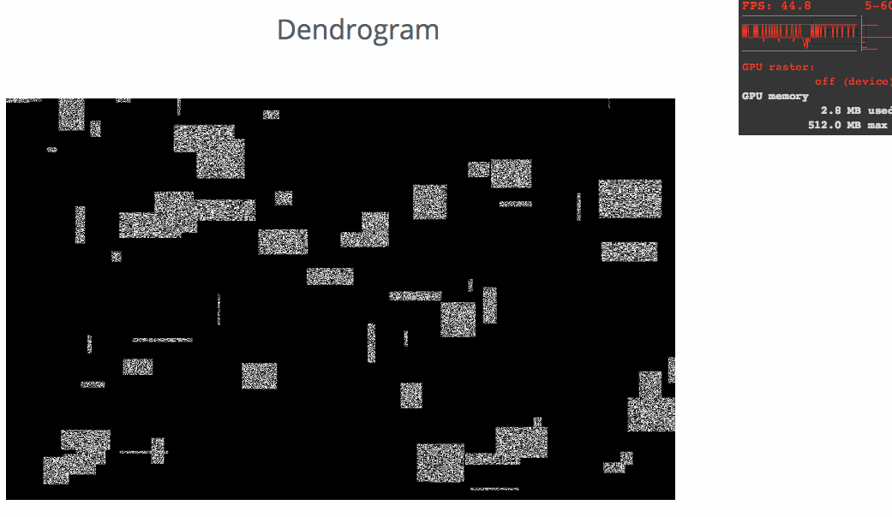

# lightning-dendrite-viewer
[lightning](https://github.com/lightning-viz/lightning/) plugin to display movies in 3d space, useful for viewing [dendrites](https://en.wikipedia.org/wiki/Dendrite)

## TODO

* normalize coordinates and set up more reasonable initial position
* figure out transparency issues
